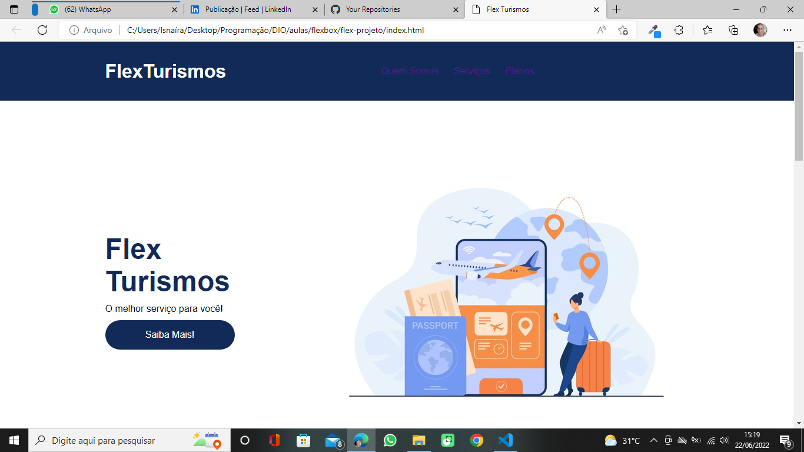
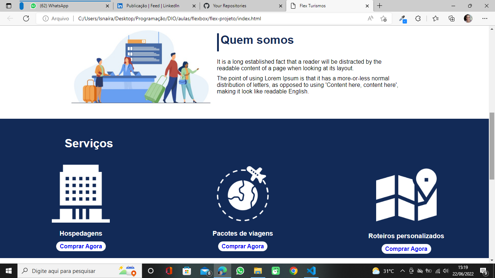
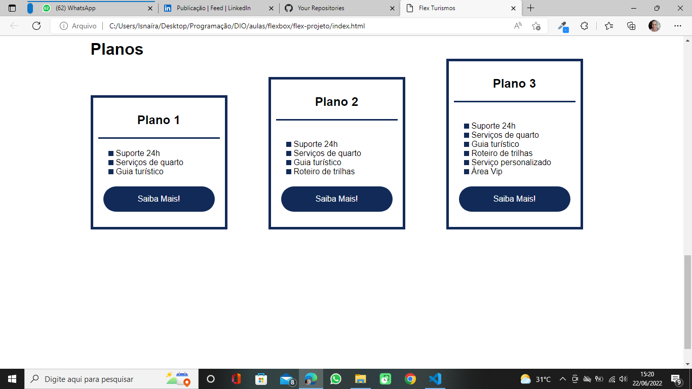
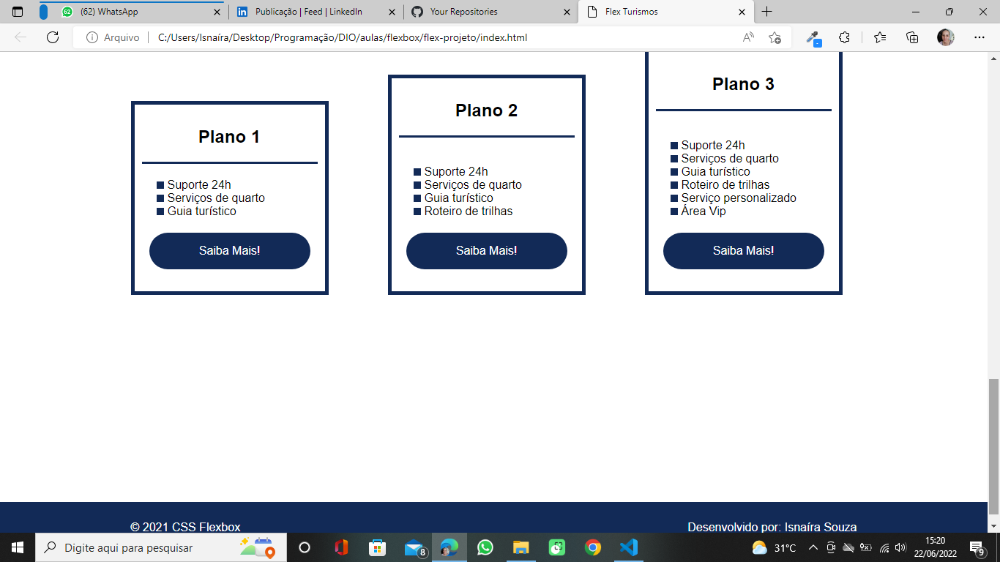

# Flex-Turismo
Completed project of the course Positioning elements with Flexbox in CSS.

 
 
 
 

> Design of a fictitious company website. This project is part of the course "Positioning elements with Flexbox in CSS" of DIO. The concept of flexbox properties is taught and practiced in this project.

## 🤝👩🏻 Collaborator

<table>
  <tr>
    <td align="center">
      <a href="#">
         
        
          <b>Isnaíra Souza</b>
        
      </a>
    </td>
    
</table>

[⬆ Voltar ao topo](#Flex-Turismo) 
